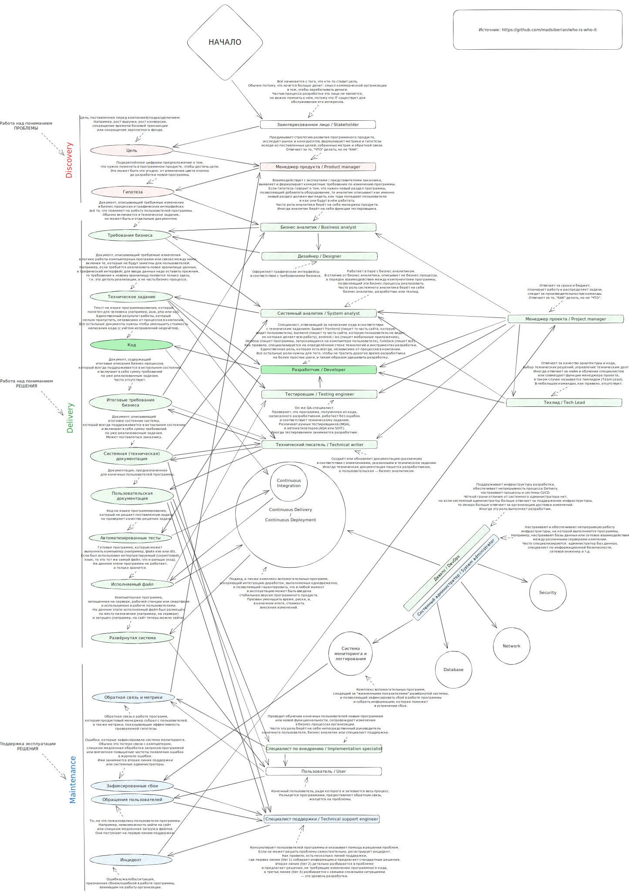

# who-is-who-it
Описание наиболее распространённых ролей в процессе разработки, их взаимодействия друг с другом и артефактами разработки.

Целевая аудитория данных документов:
- junior-специалист в IT, которому нужно разобраться чем заняты люди вокруг него;
- руководитель без технического бэкграунда, которому нужно разобраться в процессах разработки;
- рекрутер без опыта в IT, которому нужно закрыть IT-вакансию.

На данный момент, готова обзорная диаграмма ([рендер в svg](who-is-who-it.excalidraw.svg), [перманентная ссылка excalidraw](https://excalidraw.com/#json=rDqtRlxZmY8S5SnwXOHvX,SnSpD8QYf_L9aBIzW0sKkg), [исходный файл](who-is-who-it.excalidraw)).
Позже будут добавлены страницы с более детальным описанием ролей, типичными требованиями и примерами вакансий.

